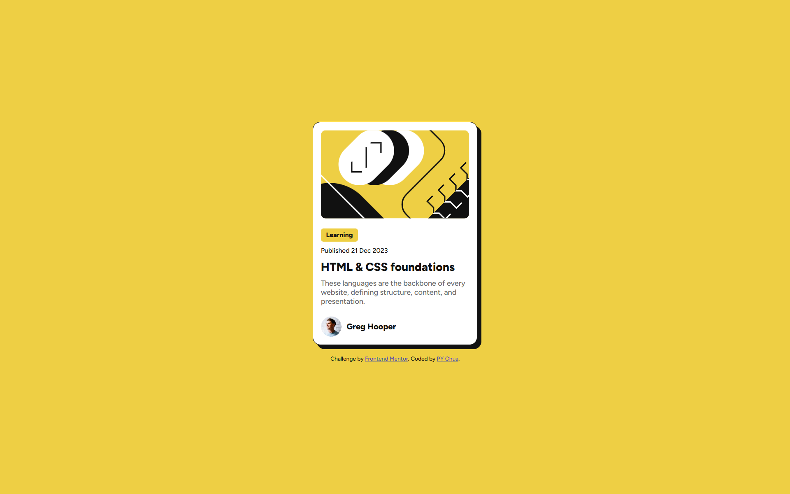

# Frontend Mentor - Blog preview card solution

This is a solution to the [Blog preview card challenge on Frontend Mentor](https://www.frontendmentor.io/challenges/blog-preview-card-ckPaj01IcS). Frontend Mentor challenges help you improve your coding skills by building realistic projects. 

## Table of contents

- [Frontend Mentor - Blog preview card solution](#frontend-mentor---blog-preview-card-solution)
  - [Table of contents](#table-of-contents)
  - [Overview](#overview)
    - [The challenge](#the-challenge)
    - [Screenshot](#screenshot)
    - [Links](#links)
  - [My process](#my-process)
    - [Built with](#built-with)
    - [What I learned](#what-i-learned)
  - [Author](#author)

## Overview

### The challenge

Users should be able to:

- See hover and focus states for all interactive elements on the page

### Screenshot



### Links

- Solution URL: [Solution URL](https://www.frontendmentor.io/solutions/mobile-first-blog-preview-card-using-css-flexbox-interactive-jhkpxbh5Ar)
- Live Site URL: [Live Site URL](https://py-chua.github.io/Frontend-mentor-Blog-preview-card/)

## My process

### Built with

- Semantic HTML5 markup
- CSS custom properties
- Flexbox
- Mobile-first responsive design
- Google Fonts (Figtree)

### What I learned

During this project, I focused on:

- Improving my ability to create responsive, mobile-first layouts using Flexbox.
- Implementing hover and focus states effectively to improve the user experience.
- Using custom properties in CSS to make the design more maintainable and flexible.

For example, I learned how to implement hover on the heading and tag:

```css
h1:hover {
    color: hsl(47, 88%, 63%);
}

.tag:hover {
    background-color: hsl(0, 0%, 7%);
    color: hsl(47, 88%, 63%);
}
```

## Author

- Frontend Mentor - [@PY-Chua](https://www.frontendmentor.io/profile/PY-Chua)